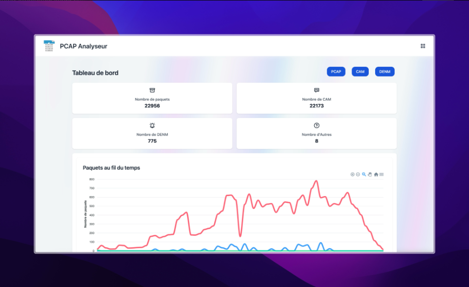
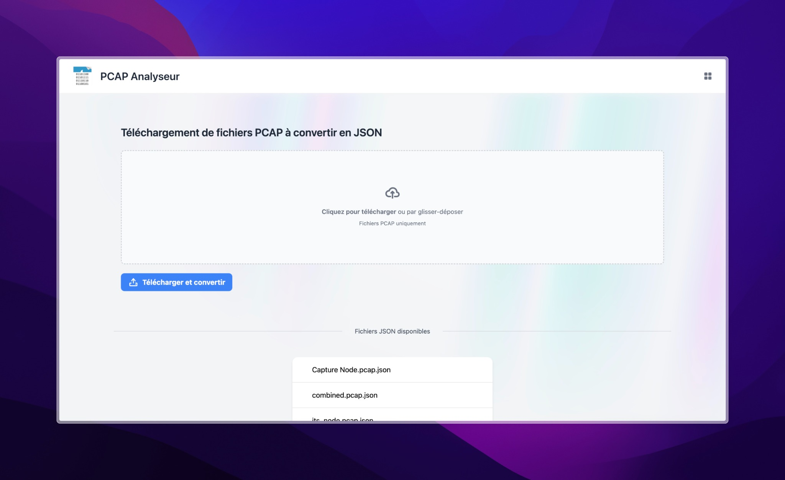
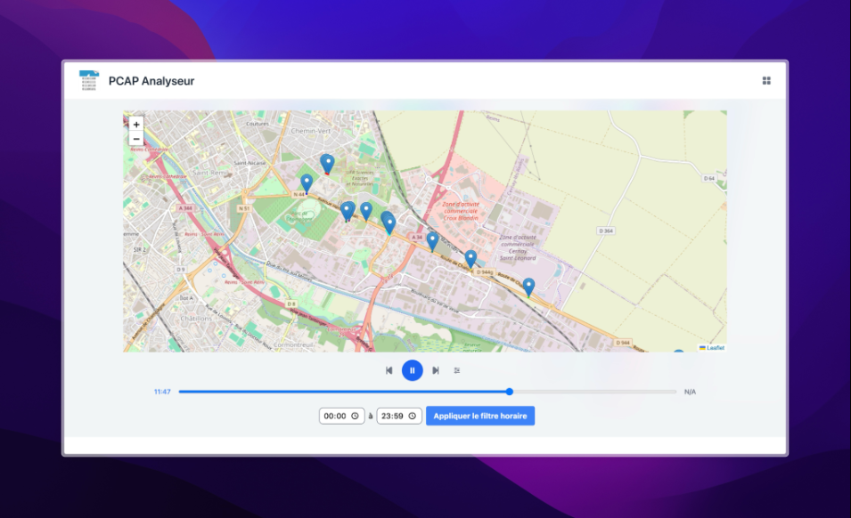
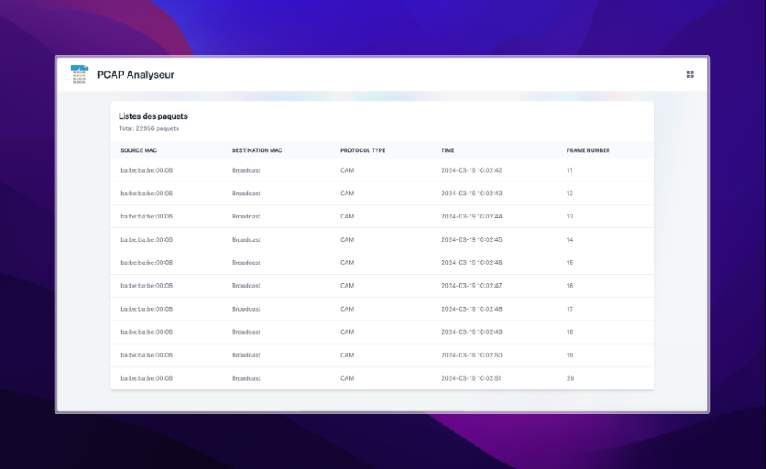

# Visualisation des Données de Communication pour les Systèmes de Transport Intelligents



    

## Introduction
Ce projet a été développé dans le cadre d'un stage au Lab-I*. Il vise à analyser et visualiser les données de communication véhiculaire capturées dans des fichiers PCAP. L'application permet d'identifier les messages DENM et CAM et d'afficher leurs informations sur une interface utilisateur interactive.


### Téléchargement et Conversion des Fichiers PCAP


### Visualisation sur Carte Interactive


### Liste des Paquets


## Structure du Projet
```
.
├── Doxyfile
├── Doxyfile.bak
├── app
│   ├── __init__.py
│   ├── classes_VehicleCommunication.png
│   ├── data
│   │   ├── json
│   │   └── pcap
│   ├── extensions.py
│   ├── models
│   │   ├── CAM.py
│   │   ├── DENM.py
│   │   ├── GeoNetworking.py
│   │   ├── Packet.py
│   │   ├── Packets.py
│   │   ├── __init__.py
│   └── ...
├── docker
│   ├── Dockerfile
│   └── docker-compose.yml
├── docs
│   ├── html
│   └── latex
├── pcap_valenciennes_retour
├── requirements.txt
├── run.py
├── scripts
│   └── start.sh
└── tests
    └── __init__.py
```

## Modèles
Les modèles de données sont situés dans le dossier `app/models` et comprennent :

- **CAM.py** : Contient les informations spécifiques aux messages CAM (Cooperative Awareness Messages), comme la vitesse, la direction, et l'identifiant du véhicule.
- **DENM.py** : Contient les informations spécifiques aux messages DENM (Decentralized Environmental Notification Messages), comme le type d'événement, la cause de l'événement, et les effets prévus.
- **GeoNetworking.py** : Modèle abstrait encapsulant les informations géographiques spécifiques à un paquet GeoNetworking.
- **Packet.py** : Classe de base pour tous les types de paquets, contenant des informations générales comme les adresses MAC, le type, et la taille du paquet.
- **Packets.py** : Contient une liste de paquets et permet d'effectuer des opérations comme le tri et le filtrage.

## Installation
Pour lancer l'application, suivez les étapes ci-dessous :

1. Clonez le dépôt :
   ```bash
   git clone https....
   cd DashboardPCAP
   ```

2. Créez un environnement virtuel Python :
   ```bash
   python3 -m venv venv
   ```

3. Activez l'environnement virtuel :
   - Sur macOS et Linux :
     ```bash
     source venv/bin/activate
     ```
   - Sur Windows :
     ```bash
     .\venv\Scripts\activate
     ```

4. Installez les dépendances :
   ```bash
   pip install -r requirements.txt
   ```

5. Lancez l'application :
   ```bash
   ./scripts/start.sh
   ```

## Utilisation
L'application permet de :

- Analyser les fichiers PCAP pour identifier les messages DENM et CAM.
- Visualiser les données sous forme de graphiques et de cartes interactives.
- Explorer les paquets réseaux capturés et vérifier leur structure et contenu.

## Contributions
Pour contribuer au projet, veuillez suivre les étapes suivantes :

1. Fork le dépôt.
2. Créez une branche pour votre fonctionnalité ou correction de bug (`git checkout -b feature/AmazingFeature`).
3. Commitez vos changements (`git commit -m 'Add some AmazingFeature'`).
4. Pushez vers la branche (`git push origin feature/AmazingFeature`).
5. Ouvrez une Pull Request.


    

## Remerciements
Merci à M. Fouchal, M. Bourdy-Liebart, et M. Wilhelm pour leur encadrement et leur soutien tout au long du stage.


